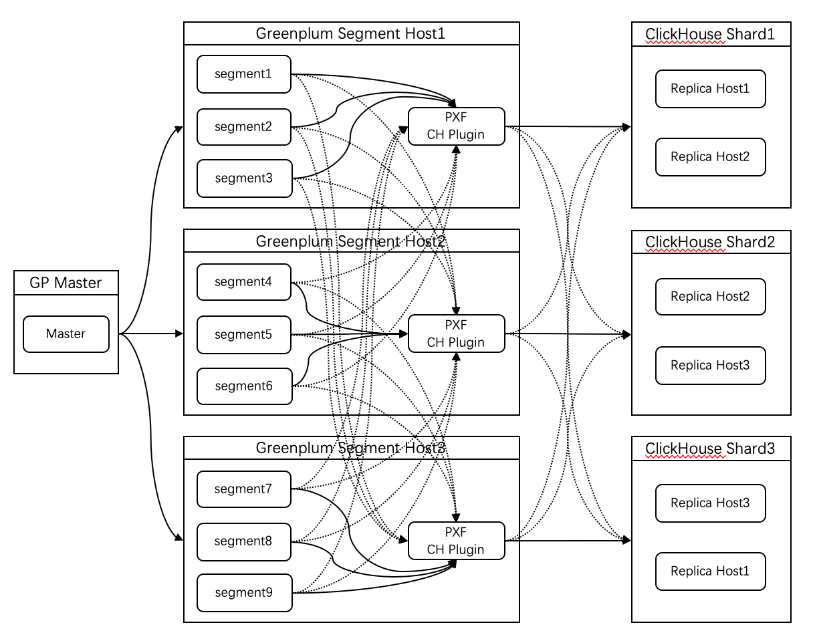

PXF-CLICKHOUSE
====

用于同步Greenplum与Clickhouse表数据

## Building

   	mvn clean package -DskipTests
  
## Prerequisites

* Java (Version: `1.8`)
* Greenplum PXF (Version: `6.0+`)

## Architecture

* 本插件为图中 PXF CH Plugin 组件(为Greenplum PXF插件的插件，Greenplum PXF在此不做介绍)。
* segment 的数据是以流的方式通过HTTP协议发送到 PXF 插件再将数据路由到本插件进行处理。
* 图中 segment 上的实线为真实HTTP请求，虚线表示有数据到当前组件。 
* 图中 Clickhouse Shard(其中Replica Host为分片中的副本)上的线均为实际jdbc连接到具体的 Clickhouse Replica Host 服务。

## Config
    #pxf/conf/pxf-profiles.xml add:
    <profile>
        <name>clickhouse</name>
        <description>A profile for reading and writing data via Clickhouse JDBC</description>
        <plugins>
            <fragmenter>org.greenplum.pxf.plugins.clickhouse.ClickHouseFragmenter</fragmenter>
            <accessor>org.greenplum.pxf.plugins.clickhouse.ClickHouseAccessor</accessor>
            <resolver>org.greenplum.pxf.plugins.clickhouse.ClickHouseResolver</resolver>
        </plugins>
        <optionMappings>
            <mapping option="jdbc_driver" property="jdbc.driver"/>
            <mapping option="db_url" property="jdbc.url"/>
            <mapping option="user" property="jdbc.user"/>
            <mapping option="pass" property="jdbc.password"/>
            <mapping option="batch_size" property="jdbc.statement.batchSize"/>
            <mapping option="fetch_size" property="jdbc.statement.fetchSize"/>
            <mapping option="query_timeout" property="jdbc.statement.queryTimeout"/>
        </optionMappings>
    </profile>
    
    #add file: pxf/servers/ck/clickhouse-site.xml
    <?xml version="1.0" encoding="UTF-8"?>
    <configuration>
        <property>
            <name>jdbc.driver</name>
            <value>ru.yandex.clickhouse.ClickHouseDriver</value>
            <description>Class name of the JDBC driver (e.g. org.postgresql.Driver)</description>
        </property>
        <property>
            <name>jdbc.url</name>
            <value>jdbc:clickhouse://192.168.0.1:8123/default;jdbc:clickhouse://192.168.0.2:8123/default;jdbc:clickhouse://192.168.0.3:8123/default</value>
            <description>Multiple shard uses; division(e.g. jdbc:clickhouse://192.168.0.1:8123/default;jdbc:clickhouse://192.168.0.2:8123/default)  Backup, split (e.g. jdbc:clickhouse://192.168.0.3:8123,192.168.0.2:8123/default)</description>
        </property>
        <property>
            <name>jdbc.user</name>
            <value>default</value>
            <description>User name for connecting to the database (e.g. postgres)</description>
        </property>
        <property>
            <name>jdbc.password</name>
            <value></value>
            <description>Password for connecting to the database (e.g. postgres)</description>
        </property>
    
        <property>
            <name>jdbc.segment.shard.writer.enabled</name>
            <value>true</value>
            <description>Only when the number of Clickhouse shard is greater than 1 can it be valid. default true</description>
        </property>
        <property>
            <name>jdbc.segment.column.name</name>
            <value>segment_id</value>
            <description>When jdbc.segment.shard.writer.enabled is valid, the value of segmentId is determined according to the configuration field name. default segment_id</description>
        </property>
    
        <property>
            <name>jdbc.pool.enabled</name>
            <value>true</value>
            <description>Use connection pool for JDBC</description>
        </property>
    
        <property>
            <name>jdbc.pool.property.maximumPoolSize</name>
            <value>5</value>
            <description>The maximum number of actual connections to the database backend</description>
        </property>
        <property>
            <name>jdbc.pool.property.connectionTimeout</name>
            <value>30000</value>
            <description>The maximum time (in milliseconds) to wait for a connection from the pool</description>
        </property>
        <property>
            <name>jdbc.pool.property.idleTimeout</name>
            <value>30000</value>
            <description>The maximum time (in milliseconds) that a connection will sit idle in the pool</description>
        </property>
        <property>
            <name>jdbc.pool.property.minimumIdle</name>
            <value>0</value>
            <description>The minimum number of idle connections to maintain in the pool</description>
        </property>
    </configuration>

* 将本工程jar放入pxf/lib目录，包括Clickhouse驱动及其依赖jar包(请用src/test/resources目录下的包或者自行编译：https://github.com/mingpeng2live/clickhouse-jdbc.git) 重启pxf集群。

* 数据写入 Clickhouse
    * 根据 segment_id 来写入到具体分片副本：
        * jdbc.segment.shard.writer.enabled (default: true) = true
        * jdbc.segment.column.name (default: segment_id) = segment_id （可以指定, 但在创建可写外部表时需包含此字段，同时写入数据时需要加入 gp_segment_id as segment_id 处理，具体参考下面列子）
    * 无需根据 segment_id 来写入：
        * jdbc.segment.shard.writer.enabled (default: true) = false
    * jdbc.url 此配置项可以配置多个url，会按照配置的顺序构建一个list：
        * segment在写入数据到Clickhouse时按照segment_id%listSize来找到对应的写入分片副本。

 
## Example  
    #往ck写入数据
        #Clickhouse create table
        drop table if exists ck_cdp_event_union ON CLUSTER cluster_3s_1r;
        truncate table if exists ck_cdp_event_union ON CLUSTER cluster_3s_1r;
        
        CREATE TABLE ck_cdp_event_union ON CLUSTER cluster_3s_1r (segment_id UInt64, superid String, array_a Array(Nullable(String))) ENGINE = ReplicatedMergeTree('/ck/tb/{shard}/ck_event_1','{replica}') ORDER BY (superid);
        
        drop table if exists ck_cdp_event_union_all;
        CREATE TABLE ck_cdp_event_union_all AS default.ck_cdp_event_union ENGINE = Distributed(cluster_3s_1r, default, ck_cdp_event_union, rand());
    
        #Greenplum create table
        create table cdp_event_union (superid varchar(100), array_a text[]) distributed by (superid);
        insert into cdp_event_union values('234','{"d,d",null,"c,r"}'),('456','{"d,f",null,"adfw"}');
        #如果需要把同一segmentId的数据写入对应的Ck分片副本则 再建表时加入segment_id字段，并在写入数据时将 gp_segment_id 映射到该字段
        drop EXTERNAL table pxf_writeto_ch;
        CREATE WRITABLE EXTERNAL TABLE pxf_writeto_ch(segment_id int, superid varchar(100), array_a text[]) LOCATION ('pxf://default.ck_cdp_event_union?PROFILE=clickhouse&SERVER=ck') FORMAT 'CUSTOM' (FORMATTER='pxfwritable_export');
        
        insert into pxf_writeto_ch select gp_segment_id as segment_id, superid, array_a from cdp_event_union where array_length(array_a, 1) > 0;

    #往ck读取数据
        #Clickhouse create table
        DROP TABLE IF EXISTS default.test_array
        
        CREATE TABLE IF NOT EXISTS default.test_array (s_arr Array(Nullable(String)), dt_arr Array(Nullable(DateTime64)), d_arr Array(Nullable(Date)), ui_arr Array(Nullable(UInt8)), i_arr Array(Int64), di_arr Array(Decimal64(6)), f_arr Array(Float64), n Nullable(Int8), s Array(Nullable(String))) ENGINE = TinyLog
        
        # 新建c.txt content:
        ['{"204_sender":"pablo","body":"they are \\"on to us"}',NULL,'{"sender":"arthur"}'] ['2019-01-01 00:00:00.456',NULL,'2019-01-03 00:00:00.789']  ['2019-01-01','2019-01-03',NULL]  [1,0,NULL]  [234243,453424] [234243.333,453424.456] [234243.333,453424.456] \N  ['aa,f',NULL,'c"cc','dd']
        # 导入数据
        cat c.txt | clickhouse-client -h 127.0.0.1 --query="INSERT INTO default.test_array FORMAT TabSeparated"
        
        
        #Greenplum create table
        drop EXTERNAL table pxf_read_ch;
        CREATE EXTERNAL TABLE pxf_read_ch(s_arr text, dt_arr text, d_arr text, ui_arr text, i_arr text, di_arr text, f_arr text, n text, s text) LOCATION ('pxf://default.test_array?PROFILE=clickhouse&SERVER=ck') FORMAT 'CUSTOM' (FORMATTER='pxfwritable_import');
        
        drop view if exists pxf_ck_read;
        create view pxf_ck_read as select s_arr::json[], dt_arr::timestamp[], d_arr::date[], ui_arr::bool[], i_arr::bigint[], di_arr::Decimal[], f_arr::float[], n::bool, s::text[] from pxf_read_ch;
    
    
    
    
    
    
    
    
